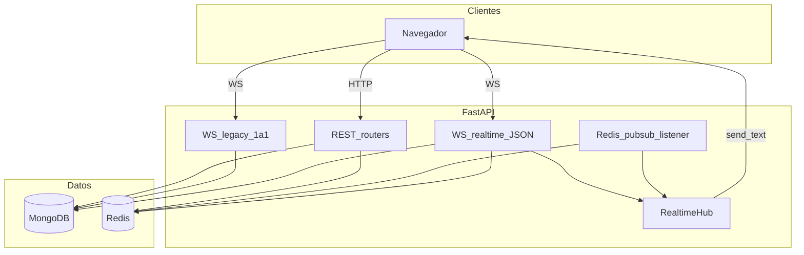

# Arquitectura — Chat Distribuido

## 1. Contexto del sistema

El sistema es un **backend** de mensajería pensado para privacidad por diseño (mínimo dato necesario). Los clientes consumen **REST** y **WebSockets** sobre FastAPI, con **MongoDB** como fuente de verdad y **Redis** para **Pub/Sub** entre instancias Uvicorn, presencia y typing.

Soporta **mensajes 1:1** y **grupos** (colecciones `grupos`, `grupo_miembros`, mensajes con `tipo: "grupo"`).

## 2. Vista de contenedores (C4 simplificado)

- **RealtimeHub:** sockets suscritos por sala lógica (`dm:min:max` o `grupo:id`).
- **Listener Redis:** `PSUBSCRIBE grupo:* dm:*`; al recibir un mensaje, el hub lo entrega solo a conexiones locales de esa sala.
- **Publicación:** tras persistir en Mongo, `PUBLISH` al canal de la sala (si no hay Redis, broadcast solo local).

## 3. Despliegue local con Docker Compose

| Servicio       | Puerto host | Rol |
|----------------|-------------|-----|
| `mongodb`      | host `${MONGO_HOST_PORT:-37117}` → 27017 en contenedor | Persistencia |
| `redis`        | 6379        | Pub/Sub, presencia, typing |
| `mongo-express`| 8081        | UI de inspección (solo desarrollo) |

La API se ejecuta con `uvicorn` y usa `MONGO_URL` y `REDIS_URL` (ver [contexto_operacional.md](contexto_operacional.md)).

## 4. Módulos de la aplicación

| Ruta / paquete | Responsabilidad |
|----------------|-----------------|
| `main.py` | Lifespan: Mongo índices, Redis, **tarea listener** Pub/Sub. |
| `routes/grupos.py` | CRUD grupos, miembros, mensajes de grupo (REST). |
| `routes/mensajes.py` | Mensajes 1:1 y conversación (REST). |
| `routes/realtime_ws.py` | WebSocket `/ws/realtime` (JSON: auth, join, message, typing). |
| `routes/chat_ws_router.py` | WebSocket legacy texto plano 1:1. |
| `routes/deps.py` | `ObjectIdPath`. |
| `services/grupo_service.py` | Grupos y membresías. |
| `services/mensaje_service.py` | DM + grupo, paginación, publicación tiempo real. |
| `core/realtime_hub.py` | Salas locales en memoria. |
| `core/realtime_publish.py` | `publish` Redis o fallback local. |
| `core/realtime_listener.py` | Suscriptor `PSUBSCRIBE`. |
| `core/realtime_channels.py` | Nombres de canales `dm:` / `grupo:`. |
| `core/redis_client.py` | Cliente Redis async. |
| `database.py` | Motor + índices. |

## 5. Seguridad y límites (versión actual)

- `session:auth` en `/ws/realtime` valida solo formato ObjectId (MVP); en producción sustituir por token firmado.
- mongo-express no debe exponerse a Internet sin hardening.

## 6. Referencias

- [chat_realtime.md](chat_realtime.md)
- [api_contract.md](api_contract.md)
- [casos_de_uso_tiempo_real.md](casos_de_uso_tiempo_real.md)
- [decisiones_tecnicas.md](decisiones_tecnicas.md)
